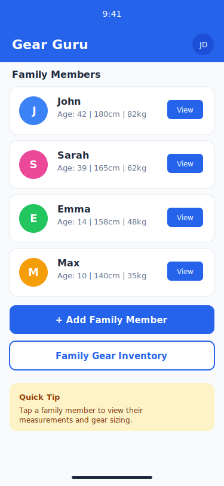
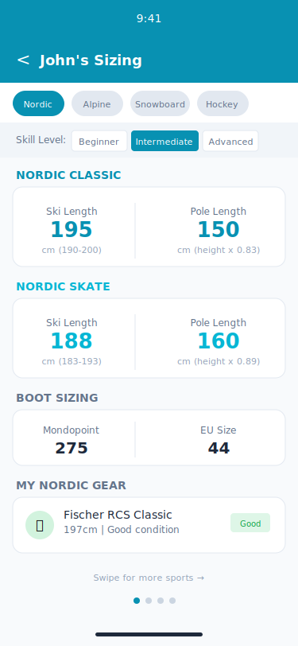
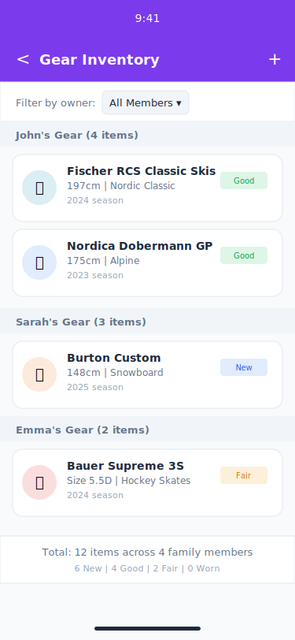
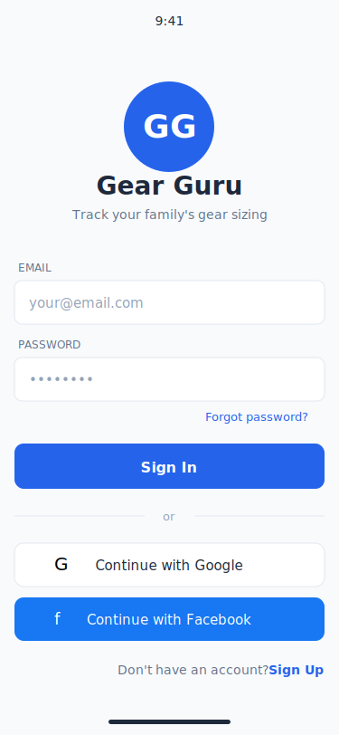

# Gear Guru Screen Mockups

This directory contains sample screen mockups for the Gear Guru application. These SVG images illustrate the key screens and user interfaces.

## Screens

### 1. Home Dashboard (`01-home-dashboard.svg`)
The main landing screen showing:
- Family member list with quick stats (age, height, weight)
- View button to access member details
- Add Family Member button
- Family Gear Inventory button
- Quick tip section

### 2. Member Detail (`02-member-detail.svg`)
Detailed view of a family member showing:
- Profile hero section with avatar
- Body measurements (height, weight, age)
- Foot measurements (left/right in cm)
- Shoe size conversions (EU, US, UK, Mondopoint, CM)
- Ski boot shell size recommendations
- Last measurement date

### 3. Sport Sizing Calculator (`03-sport-sizing.svg`)
Equipment sizing recommendations with:
- Sport tabs (Nordic, Alpine, Snowboard, Hockey)
- Skill level selector
- Sport-specific sizing (Nordic Classic & Skate shown):
  - Ski length recommendations with ranges
  - Pole length calculations
  - Boot sizing (Mondopoint/EU)
- My Gear section showing owned equipment
- Swipe navigation between sports

### 4. Gear Inventory (`04-gear-inventory.svg`)
Family gear tracking with:
- Filter by owner dropdown
- Gear grouped by family member
- Gear cards showing:
  - Sport icon
  - Brand and model
  - Size and sport type
  - Season year
  - Condition badge (New, Good, Fair, Worn)
- Summary footer with totals

### 5. Authentication (`05-authentication.svg`)
Sign-in screen featuring:
- App logo and tagline
- Email/password input fields
- Forgot password link
- Sign In button
- Social sign-in options (Google, Facebook)
- Sign Up link for new users

## Design Specifications

- **Viewport**: 375 x 812 (iPhone standard)
- **Primary Color**: #2563eb (Blue)
- **Typography**: system-ui, sans-serif
- **Corner Radius**: 10-12px for cards, 6-8px for inputs
- **Sport Colors**:
  - Nordic: #0891b2 (Cyan)
  - Alpine: #3b82f6 (Blue)
  - Snowboard: #f97316 (Orange)
  - Hockey: #dc2626 (Red)

## Condition Badge Colors

| Status | Background | Text |
|--------|------------|------|
| New | #3b82f6 (15%) | #2563eb |
| Good | #22c55e (15%) | #16a34a |
| Fair | #f59e0b (15%) | #d97706 |
| Worn | #ef4444 (15%) | #dc2626 |
